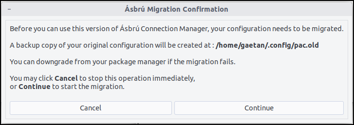
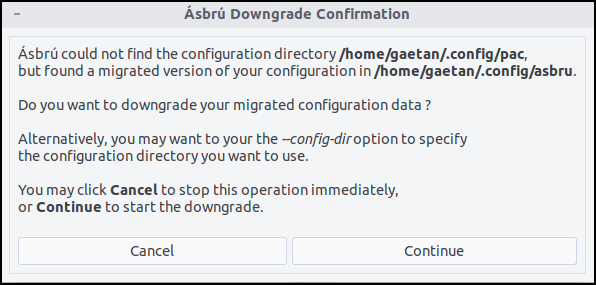
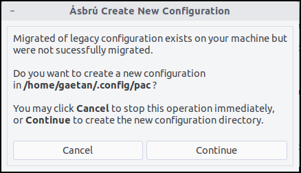

# How do I upgrade or downgrade Ásbrú Connection Manager ?

## Software

### Official packages

If you installed Ásbrú Connection Manager from our packages prepared for most of the popular distributions, you simply need to upgrade or downgrade the package according to the procedure of your favorite distribution.

For Debian-based distributions, it would typically be:

```
sudo apt-get update
sudo apt-get install --only-upgrade asbru-cm
```

to downgrade to a specific version:

```
sudo apt-get install asbru-cm=6.1.2
```

to list all past versions available for your distribution, you can typically use:

```
apt-cache madison asbru-cm
```

For Fedora-based distributions, it would typically be:

```
sudo dnf update asbru-cm -y
```

to downgrade to a specific version:

```
sudo dnf install asbru-cm-6.0.4-1.fc31
```

to list all past versions available for your distribution, you can typically use:

```
dnf --showduplicate list asbru-cm
```

### Manually from sources

If you installed Ásbrú Connection Manager manually from our git repository, you will need to pull the desired versions to your local copy.

Here is an example to upgrade to version 6.2:

```
$ cd /path/to/asbru-cm
$ git fetch --tags
$ git checkout 6.2.0
```

## Configuration file

Even if we believe we did everything to avoid data loss, we cannot guarantee the upgrade/downgrade process is 100% safe so before proceeding to any major changes, please make a safe backup copy of your configuration directory (that is by default ```~/.config/asbru```).

### Upgrade/downgrade of configuation file

At startup, **Ásbrú Connection Manager** is proceeding with the necessary steps to upgrade your configuration, and, to some extent, downgrade, files to the currently running version.

### File rename

Please note that files have been renamed in version 6.2 ; the main directory is now ```~/.config/asbru``` (instead of ```~/.config/pac```).  Files inside the directory have also be renamed (as an example: ```pac.yml``` is now ```asbru.yml```)

Again, at startup, **Ásbrú Connection Manager** will make the necessary changes automatically; a warning message will give you the opportunity to think twice about it:



As stated in the message, to minimize risks of data loss, during the upgrade process, a safe copy of your existing configuration will be done to ```~/.config/pac.old```.

### Specific configuration

When starting an old version (6.0 or higher), you can use the option ```--config-dir``` to start with a specific configuration directory (instead of the default one).  Which means you can start from any backup copy, as an example:

```
asbru-cm --config-dir ~/.config/pac.old
```

### Downgrade

When starting an old version (6.1.x), Ásbrú will propose to downgrade your migrated configuration:



Please note that, as for the upgrade, a copy of your existing configuration will be done before processed with the downgrade.

If you don't want to downgrade your files, you will be offered to create a new configuration directory:



### Migration scripts

Upgrade and downgrade scripts are available in the ```utils``` directory, the last versions are:

- Upgrade script: [pac2asbru.pl](https://github.com/asbru-cm/asbru-cm/blob/master/utils/pac2asbru.pl)
- Downgrade script: [asbru2pac.pl](https://github.com/asbru-cm/asbru-cm/blob/master/utils/asbru2pac.pl)
